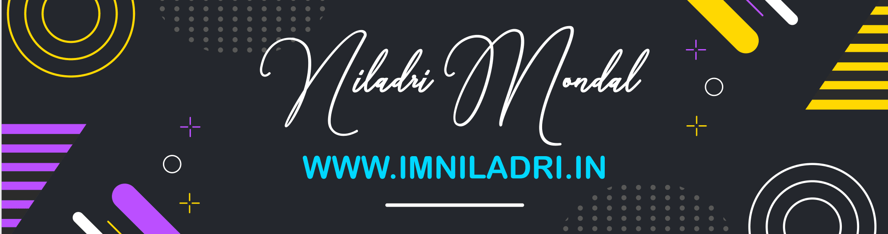

# Hi!, I'm Niladri Mondal
## I'm a Student & Creative Front End Developer!!
**_[@imniladri](https://github.com/imniladri)_**

### 
### 
### 
### 
### 
### 

 
 

### About Me:

- 👨🏻‍🎓 **Currently pursuing my B.Tech in EE.**
- 🔭 **I’m currently working on React.**
- 🌱 **I’m currently learning React.**
- 👯 **I’m interested in Creative Projects.**
- 🥅 **I want to Contribute more to Open Source & Web projects.**
- 📫 **Reach me at JGEC, India.**

### Languages and Tools:

 
 

### Github Stats:

<!--  -->

 

 

--_Thank You_--
